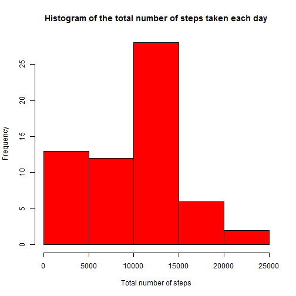
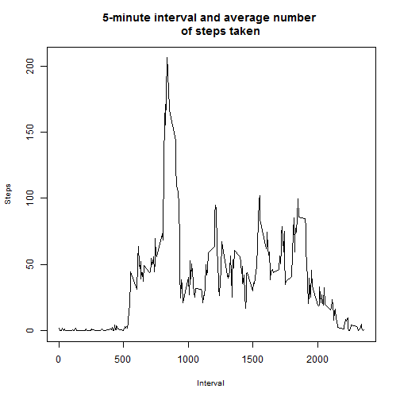
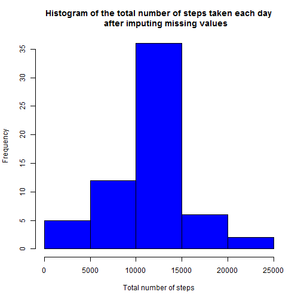
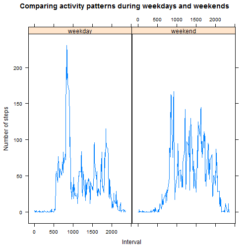

# Reproducible Research: Peer Assessment 1

## Loading and preprocessing the data


```r

# Set temp variables to store zipped file and extract directory
tmpzip = paste0("tmp", format(Sys.time(), "%Y%m%d%H%M%S"), ".zip")
tmpdir = paste0("tmp", format(Sys.time(), "%Y%m%d%H%M%S"))

# set the R_WIN_INTERNET2 to TRUE, for the download.file to work on https
# Download the zipped file and unzip in a temp directory
setInternet2(TRUE)

download.file("https://d396qusza40orc.cloudfront.net/repdata%2Fdata%2Factivity.zip", 
    tmpzip)
tmpcsv = unzip(tmpzip, exdir = tmpdir)

# Load the activity data file
activity = read.csv(tmpcsv, colClasses = c("numeric", "character", "numeric"))

# Delete the temp directory and files
unlink(tmpzip)
unlink(tmpdir, recursive = TRUE)
```


```r


# Convert character data in date column to a date data type
activity$date = as.Date(activity$date, format = "%Y-%m-%d")
```


## Histogram of the total number of steps taken each day


```r

# Create summary by total number of steps per date, from the original data
# with missing values
totStepsNA = with(activity, aggregate((steps), list(date), sum, na.rm = TRUE))
colnames(totStepsNA) <- c("date", "steps")

# Plot histogram using the original data
hist(totStepsNA$steps, xlab = "Total number of steps", ylab = "Frequency", main = "Histogram of the total number of steps taken each day", 
    col = "red")
```

 


## What is mean total number of steps taken per day?


```r

# Calculate the mean and median from the original data with missing values
meanTotStepsNA = mean(totStepsNA$steps, na.rm = TRUE)
medianTotStepsNA = median(totStepsNA$steps, na.rm = TRUE)
```


The mean is 9354.2295 and the median is 1.0395 &times; 10<sup>4</sup>

## What is the average daily activity pattern?


```r

# Create averages by intervals, from the original data with missing values
avgSteps = with(activity, aggregate((steps), list(interval), mean, na.rm = TRUE))
colnames(avgSteps) <- c("interval", "steps")

# Plot interval vs steps
plot(avgSteps$interval, avgSteps$steps, xlab = "Interval", ylab = "Steps", main = "5-minute interval and average number \n      of steps taken", 
    type = "l", cex = 0.01, lwd = 0.01, cex.lab = 0.85)
```

 

```r

# Find the interval with the max steps by ranking the data first and
# selecting the top row for the first rank
avgSteps$rank = ave(-avgSteps$steps, FUN = function(x) rank(x, ties.method = "min"))
intvMaxSteps = head(subset(avgSteps, rank == 1), 1)
```

The interval with the maximum number of steps is 835 with 206.1698 average steps


## Imputing missing values


```r

# Create temp dataframe that has only the rows with missing values
activityMissing = activity[!complete.cases(activity), ]

# Create a new dataframe where the missing values are filled with the
# average for that 5-minute interval
activityMissingFixed = merge(x = activityMissing, y = avgSteps, by.x = "interval", 
    by.y = "interval")

# Remove unused columns and rename the steps column to match the activity
# dataframe
activityMissingFixed$steps.x = NULL
activityMissingFixed$rank = NULL
names(activityMissingFixed)[names(activityMissingFixed) == "steps.y"] = "steps"

# Create tidy dataset by combining the clean rows from the original data
# with the fixed data
activityTidy = rbind(activity[complete.cases(activity), ], activityMissingFixed)

# Create summary by total number of steps per date, from the tidy data
totSteps = with(activityTidy, aggregate((steps), list(date), sum))
colnames(totSteps) <- c("date", "steps")

# Calculate the mean and median from the original data with missing values
meanTotSteps = mean(totSteps$steps)
medianTotSteps = median(totSteps$steps)

# Plot histogram using the tidy data
hist(totSteps$steps, xlab = "Total number of steps", ylab = "Frequency", main = "Histogram of the total number of steps taken each day\n      after imputing missing values", 
    col = "blue")
```

 


Total number of rows with missing values in the dataset is 2304

After imputing missing values by filling with the average for that 5-minute interval - 

The new mean is 1.0766 &times; 10<sup>4</sup> and the new median is 1.0766 &times; 10<sup>4</sup>

The mean has changed by 1411.9592 and the median has changed by 371.1887

## Are there differences in activity patterns between weekdays and weekends?


```r

# Add factor variable that captures weekday/weekend
activityTidy$dayType = as.factor(ifelse(weekdays(activityTidy[["date"]]) == 
    "Saturday" | weekdays(activityTidy[["date"]]) == "Sunday", "weekend", "weekday"))

# Create averages by day type and intervals
avgStepsDayType = with(activityTidy, aggregate((steps), list(dayType, interval), 
    mean))

colnames(avgStepsDayType) <- c("dayType", "interval", "steps")

# Load library for lattice plots
library(lattice)

# Panel Plot
xyplot(avgStepsDayType$steps ~ avgStepsDayType$interval | avgStepsDayType$dayType, 
    xlab = "Interval", ylab = "Number of steps", main = "Comparing activity patterns during weekdays and weekends", 
    type = "l", cex = 0.01, lwd = 0.01, cex.lab = 0.85)
```

 

